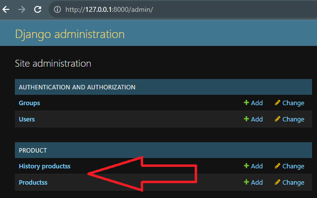

# UpdateDB

## Overview

This project streamlines warehouse control by utilizing Docker Compose to orchestrate three services: a PostgreSQL database, a Python script for XML data conversion into two tables, and a Django-admin based webpage for continuous database interaction.

## Getting Started

To get started, use the provided `docker-compose.yml`. This will build three services:

1. **PostgreSQL Database:** Handles storage for the converted XML data.
2. **Python Script:** Converts data from XML into two tables within the database, tracking current item quantities and providing a history of quantity changes.
3. **Webpage (Django-admin):** Offers a convenient method for interacting with the database.

## Usage

1. Start the services:

   ```bash
   docker-compose up
2. Open http://localhost:8080/admin in your browser.

3. Log in with the following credentials:

```
Username: admin
Password: admin
```
